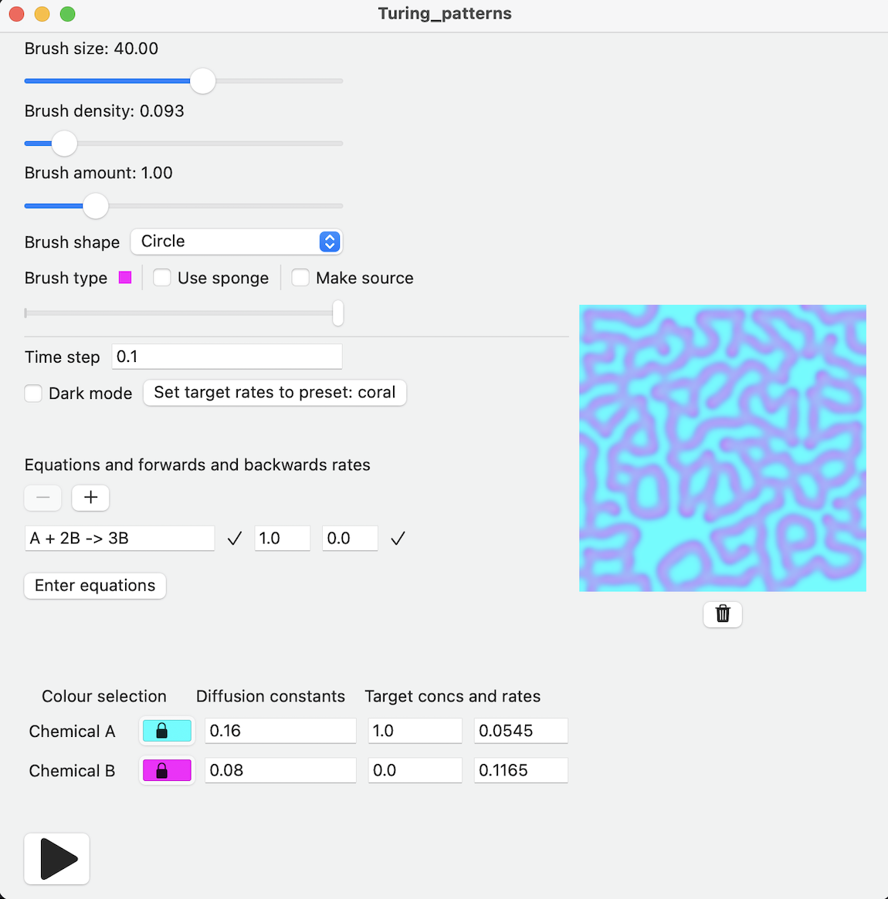

A reaction-diffusion simulation which the user can interact with by dragging a brush to place different chemicals. Diffusion and chemical reactions are simulated, and the latter can be specified by the user.

Initial parameters are set to produce a Turing pattern so painting on the canvas, pressing play, then waiting will produce one.

Hidden features:
* Press space to pause/play simulation
* If the number of chemicals is less than 4, the concentrations of each are displayed using one chemical per colour channel (RGB or CYM) and the colour pickers cannot be changed. Otherwise, the colour of the chemical with the highest concentration is shown at each pixel.

__UI input__
* Time step and Diffusion constants should be integers or doubles. Invalid input results in the use of a default value.
* On startup, default chemical equations are shown. Equations must contain an arrow '->' and have at least one chemical on either side. Chemicals are named by any string of consecutive letters. The chemical's coefficient must be immediately before the chemical's name and must be an integer. Lack of a coefficient implies it is 1. Elsewhere, whitespace does not matter.
* To the right of the each equation, the forwards and backwards rates of reaction may be specified and should be integers or doubles.
* Ticks and crosses are shown next to the equations and rates indicating their validity.
* A red message will appear next to the Enter equations button when the equations or rates are invalid or have been edited and not saved. Fixing the invalid input and pressing this button will allow the Play button to be pressed which starts the simulation.

